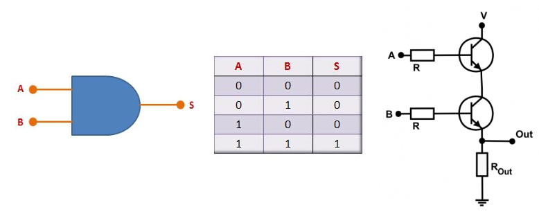
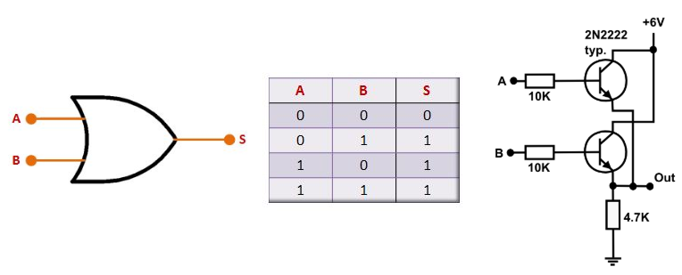
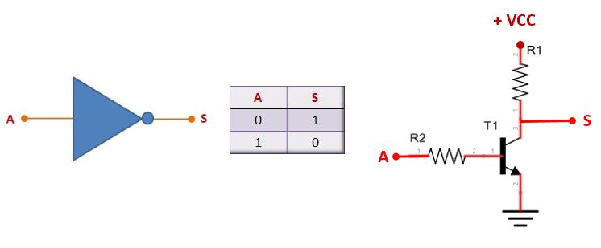
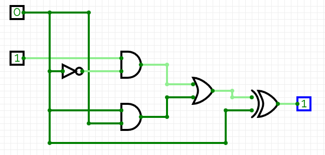
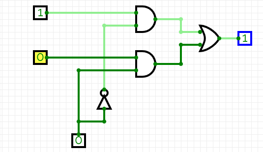
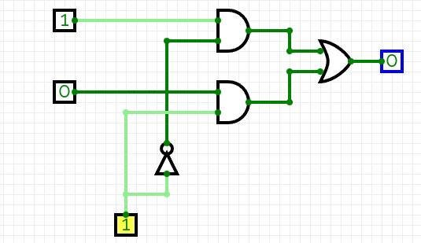
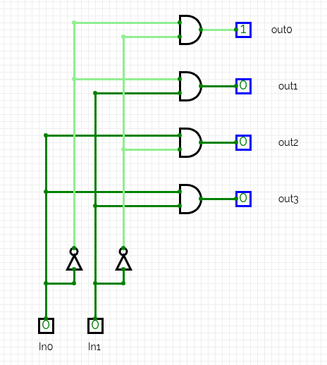
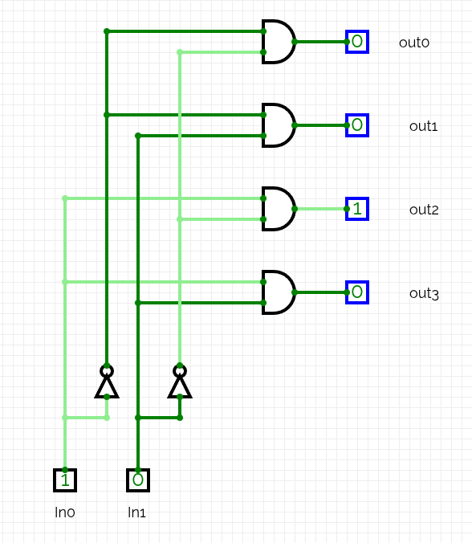
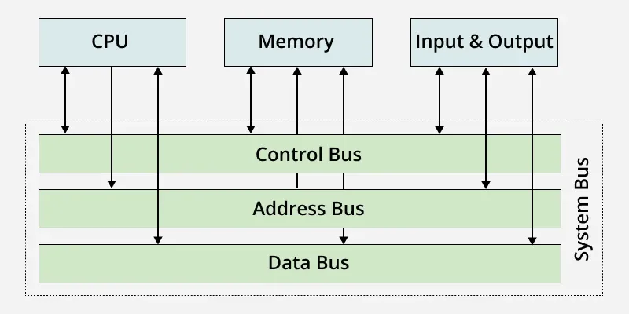

# Study Folder

This folder contains materials to study and get knowledge about basic computing components like UCP, RAM and SRAM memory, chip, SoCs, etc. It covers from basic concepts like digital logic till microprocessors and computer architecture. We really recommend you study this material before move to the next folders and dive into the project. Furthermore, we also recommend install the tools and practice the subjects you study here, gaining insights and getting prepared to contribute to the project.

# What is a computer?

A computer is any device that is able to **receive, store, compute and show** data. Examples of computers are: a simple hand calculator, a personal computer, a smartphone, etc. Their main processors and other chips are made using logic circuits (layer above physical transistors). In summary, they are built using a set of logic gates, which are a set of transistors in reality. In this project we are working only with digital logic, so transistos will not be so much explored. 

# Basic logic gates

### And gate

The and gate is one of the basic building blocks of the digital systems. It is made of inputs, output and logic. The output signal will be 1 if all inputs are 1, 0 in another case. The figure below show The and gate, its logic and the set of transistors used to build this logic gate.

### Or gate

The or gate is the opposite of the and gate. the output signal will be 1 if at least one of input signals is 1. If all input signals are 0, so the output signal is 0. The figure bellow show the or gate schematic, its logic and the set of transistors.

### Not gate

The not gate is also called the inverter gate, because it inverts the input signal and send it to the output signal, so output signal will be the inverted input signal. The photo bellow show the schematic, its logic and set of transistors:

### Other gates

Other gates like nor, nand, xnor can be built using the 3 basic gates above, so we are not going to discuss them here. If you wanna try them, use some online simulator and test the combinations to create them.

# Combinational circuits

A combinational is any circuit that its outputs depends solely of the input signals and the arrangement of logic gates. They are also called circuits without memory. These circuits are useful to create specific components that don't require complex operations, but only combinations to create desired result. figure below shows a simple combinational circuit.

The output depends solely of the two input values and the arrangement of the logic gates, nothing elese. These logic gates can be combined to create other basic building blocks like multiplexers, encoders and decordes.

### Multiplexer (Mux)

A multiplexer (also called mux) is a combinational circuit that is used to make one of the input signals goes directly to the output signal. For that, the mux has an additional input called selector. It is used to literally select which signal must go to the output. The figures below show a simple 2x1 mux.

As you can see, the output signal is one of the inputs and the selector input chooses it. Muxes are a very important building block in digital design. 

### Decoders

Decorders are also building blocks commonly used in digital circuitos. A decoder decodes an input n-bit binary number by setting one of the decorder's 2^n^ outputs to 1. For example, a 2-input decoder would have 2^n^ outputs. The image bellow shows a decoder internally and how it works.

When both inputs are 0, the output 0 is 1, if input 0 becomes 1.

 Then the output 0 becomes 0 and output 3 becomes 1. Always one of the outputs will be 1 no matter the values of the inputs. 

## Data bus

A data bus is a communication system used to exchange data between different componentes inside a computer (like data being transferred between processor and mother board). There are 3 kinds of data bus: control bus, address bus and data bus. Image below show a schematich.

### Address bus

It is a set of tracks (wires) used to identify blocks of memory, locating the right memory address. It transports memory address used by the processor to access these address, writting or reading dada from them. It is an unidirectional bus (only one direction).

### Data bus

Set of tracks used to send/receive data from one component to another, like from processor and memory or I/O devices. It is a bidirectional bus, so data can be sent and received by same bus.

### Control bus

Set of tracks used to transport control and time data between the UCP and other devices. 

# References

https://www.bosontreinamentos.com.br/eletronica/eletronica-digital/porta-logica-and/
https://www.bosontreinamentos.com.br/eletronica/eletronica-digital/porta-logica-not-inversora/
https://www.bosontreinamentos.com.br/eletronica/eletronica-digital/porta-logica-nor/
https://www.geeksforgeeks.org/digital-logic/applications-of-decoders/

